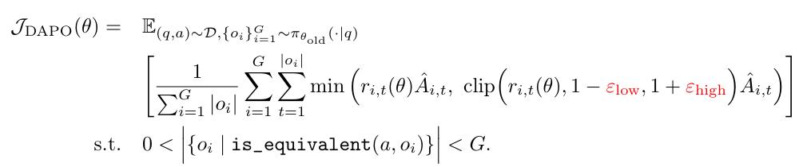
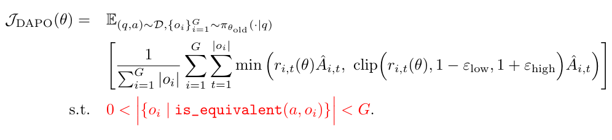
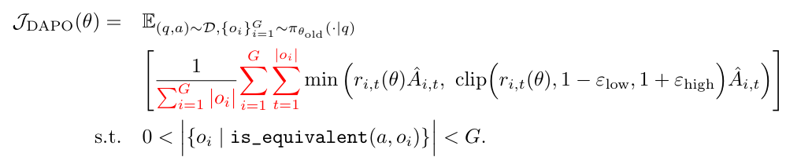
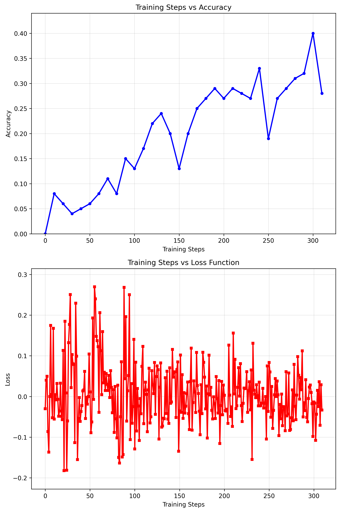

# dapo_reproduce

## 1. DAPO算法基本原理

[DAPO（Decoupled Clip and Dynamic Sampling Policy Optimization）](https://arxiv.org/pdf/2503.14476)，是字节跳动提出的一种开源强化学习算法，主要是针对CoT模型长文本训练进行了优化。

### 1.1 核心优化点
- **Clip-Higher**：解耦剪切范围，增强探索能力
- **Dynamic Sampling**：动态采样提升样本效率，引入动态采样策略，过滤掉准确率为0或1的样本，确保每个批次中保留具有有效梯度的样本，从而提高训练稳定性和效率
- **Token-Level Policy Gradient Loss**：针对长CoT的损失优化，改为token级损失计算，直接对所有token的损失求平均，确保每个token对策略优化的贡献更均衡
- **Overlong Reward Shaping**：减少奖励噪声稳定训练，提出“软超长惩罚”（Soft Overlong Punishment），通过长度感知的奖励整形机制，在一定范围内逐渐增加惩罚，避免对合理长样本的过度惩罚，提升训练稳定性

### 1.2 算法核心实现
1. **Clip-Higher**


```python
coef_1 = torch.exp(action_log_probs - old_action_log_probs) # 重要性采样
coef_2 = torch.clamp(coef_1, 1 - self.args.clip_eps_low, 1 + self.args.clip_eps_high) # 剪切上下限解耦
```
2. **Dynamic Sampling**


```python
advantages = (rewards - mean_group_rewards) / (std_group_rewards + 1e-8) # group advantage
# 动态采样，如果优势全为0(组内奖励值一致)，舍弃该组数据(对更新模型没有用)
nonzero_num = advantages.count_nonzero().item()
if nonzero_num == 0 or nonzero_num == len(advantages):
    continue
```
3. **Token-Level Policy Gradient Loss**


```python
# DAPO计算Token级Loss, 平等对待每个token, 长序列对整体损失贡献更大
# GRPO用序列均值近似计算样本级Loss, 平等对待每个样本, 但序列内的token损失被平均, 因此长序列的损失可能被稀释
per_token_loss = per_token_loss.view(-1, self.args.num_generations, num_actions)
action_mask = action_mask.view(-1, self.args.num_generations, num_actions)
loss = per_token_loss.sum(-1).sum(-1) / action_mask.sum(-1).sum(-1)
loss = loss.mean()
```
那能不能让他不平等的对待每个token，就是高权重的token对损失贡献大，低权重token对损失贡献小
DAPO（或类似 DPO、IPO、KTO 等对齐算法）中，默认是平等对待每个 token，导致：长序列损失贡献大、短序列损失贡献小、无法区分token重要性
区分token重要性可以通过以下方法解决：
1）Token 级 Loss 加权（最直接）：在计算 loss 时，对每个 token 的 loss 乘以权重
2）重要性采样（Importance Sampling）：在训练时，高权重 token 被采样的概率更高
3）分层 Loss（Hierarchical Loss）：将 token 分为“关键 token”和“普通 token”，分别计算 loss
4）Focal Loss（聚焦损失）：让模型“聚焦”在难学的 token 上


## 2. 数据集
GSM8K数据集是由8.5K个高质量的小学数学问题组成的语言模型训练数据集. 每个问题包含"question"和"answer"两个字段, answer中给出了问题的推理过程和最终的答案. 单个数据示例如下所示:

```
question: Natalia sold clips to 48 of her friends in April, and then she sold half as many clips in May. How many clips did Natalia sell altogether in April and May?
answer: Natalia sold 48/2 = <<48/2=24>>24 clips in May.
Natalia sold 48+24 = <<48+24=72>>72 clips altogether in April and May.
#### 72
```

### 2.1 对话格式
在提示词中要求模型回复中需要包含思考过程和答案
* 思考过程需要用标签\<think\>(思考过程)\</think\>标记
* 答案需要用标签\<answer\>(答案)\</answer\>标记

### 2.2 奖励函数
1. **正确性奖励** (`correctness_reward`)
   - **权重**：2.0
   - **逻辑**：提取的答案与标准答案完全一致时给高分
   - **目的**：直接优化答案准确性

2. **数字奖励** (`digit_reward`)
   - **权重**：0.5
   - **逻辑**：只要提取的是数字就给奖励
   - **目的**：解决奖励稀疏问题，鼓励生成数字答案

3. **格式奖励** (`hard_format_reward`)
   - **权重**：0.5
   - **逻辑**：严格匹配指定的XML格式
   - **目的**：确保输出格式规范

4. **标记奖励** (`mark_reward`)
   - **权重**：动态计算
   - **逻辑**：检查必要XML标签的数量
   - **目的**：逐步引导模型学习格式要求

## 3. 效果展示
* 目标模型: qwen2.5-1.5B-Instruct
* 硬件配置: 1 × AutoDL vGPU-48G
* 训练步数: 300 steps (60min)

训练结果如下图所示，训练过程持续300步，Loss逐渐收敛，回答准确率持续上升。（为节省时间没有继续训练下去）


## 4. 项目运行

### 环境配置
```bash
# 克隆代码
git clone https://github.com/TeenLucifer/dapo_reproduce

# 下载模型和数据集
sudo apt-get update
sudo apt-get install git-lfs
git clone https://hf-mirror.com/datasets/swulling/gsm8k_chinese
git clone https://www.modelscope.cn/Qwen/Qwen2.5-1.5B-Instruct.git

# 安装依赖
pip install uv
echo 'export UV_DEFAULT_INDEX="https://pypi.tuna.tsinghua.edu.cn/simple"'>> ~/.bashrc
uv sync
```

### 训练运行
```bash
uv run train.py
```

## 5.参考资料
1. 感谢b站大佬偷星九月333的[开源项目](https://github.com/wyf3/llm_related)，实现了大部分算法逻辑。
2. 字节的[DAPO论文](https://arxiv.org/pdf/2503.14476)，从多个工程实践的角度优化了GRPO算法。
